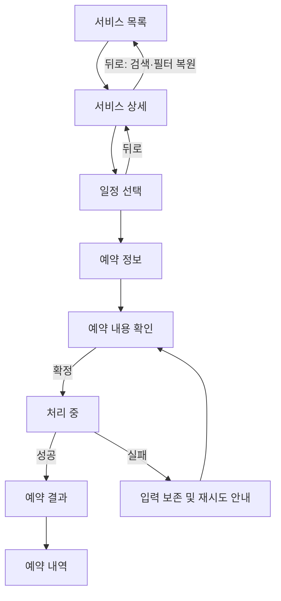

# 작업 크기에 맞춘 동선 명세

작은 수정은 영향받는 경로만 적는다. 신규 앱이나 주요 재설계는 아래를 사용한다. 템플릿을 채우기 위해 없는 기능을 만들지 않는다.

## 목표와 구조

- 사용자/상황:
- 핵심 작업과 완료의 의미:
- 제약과 가정:
- 전역 진입점과 각 역할:
- 선택한 패턴과 적용 이유:
- 참고 근거와 범위: 실측 / 요구사항 / 설계 제안 중 해당하는 것. 확인하지 않은 기존 앱 동선은 미확인으로 표시.

## 화면 목록

| ID/화면 | 사용자 목적 | 진입 | 핵심 정보 | 주 행동 | 보조 행동 | 뒤로/닫기 | 필요한 상태 |
|---|---|---|---|---|---|---|---|

## 전이 목록

| 출발 | 사용자 행동 | 조건/검증 | 도착 또는 상태 변화 | 저장·외부 효과 | 실패/취소·복귀 |
|---|---|---|---|---|---|

서버 처리 중에는 버튼 상태와 재시도 방식을, 완료 후에는 목록/홈의 갱신 범위를 정한다. 링크와 버튼이 존재하면 목적지 또는 동작도 정의한다.

입력 방식이 여러 개면 분기별 필수 정보와 합류 지점을 적는다. 예: 직접 입력/최근 대상 선택 → 대상 확인. 복귀 시에는 검색어·필터·스크롤·작성 값 중 무엇을 유지할지, 시트를 닫으면 임시 선택을 취소할지 적용할지 명시한다. 이 상태 보존 규칙은 설계 기준이며 토스에서 검증된 동작으로 단정하지 않는다.

## 흐름도 예시 — 예약 서비스에 대한 제안

예약처럼 확인이 필요한 작업의 예다. 단순 저장이나 콘텐츠 열람에는 이 단계를 그대로 강제하지 않는다.

## 확인 기록

| 시나리오 | 기대 결과 | 확인 방법 | 결과/미확인 이유 |
|---|---|---|---|

필수 후보: 핵심 작업 완료, 상세에서 목록 복귀, 오류 후 수정/재시도. 조건부 후보: 빈 목록, 키보드 노출, 권한 거절, 세션 만료, 오프라인 저장, 중복 제출, URL 직접 진입.

정적 검토, 모의 데이터 동작, 실제 서버 검증을 구분한다. 코드만 작성한 상태를 실기기 검증으로 보고하지 않는다.
